# Inventario NFC + báscula

Firmware para ESP32-S3 (pantalla táctil [JC3248W535](docs/JC3248W535%20Specifications-EN.pdf)) que controla el
inventario de utillajes (bulones) de un almacén: cada caja lleva un tag NFC, y una báscula RS232
hace de "lector" — pasas el tag, pesas la caja, y el sistema calcula solo cuántas unidades nuevas
quedan y cuántas se han usado, sin teclear números.


## Cómo se usa

1. **Reposo**: la pantalla muestra los últimos artículos inventariados.
2. **Pasar el tag NFC** de la caja sobre el lector (PN532). Tres casos:
   - **Artículo conocido**: coloca la caja completa en la báscula. En cuanto el peso se
     estabiliza, el sistema calcula las unidades totales solo (`peso / peso_unitario`) y pasa
     directo a "RETIRE NUEVOS".
   - **Tag no reconocido pero el código ya existe** en `datos_maestros.csv`: tras teclear el
     código, se muestra la descripción a toda pantalla para confirmar que es el material correcto
     (evita errores de tecleo o cajas mal etiquetadas). Si al artículo le faltaba la tara y/o el
     peso unitario, se completan sobre la marcha (pesando la caja vacía y/o pidiendo las unidades)
     sin volver a pedir la descripción.
   - **Material totalmente nuevo**: arranca el alta guiada completa (peso total → código →
     unidades → tara vacía → calibre/cabeza), con una descripción provisional
     `TEMPORAL calibre x cabeza` pendiente de corregir a mano en Excel.
3. **RETIRE NUEVOS**: mientras se van sacando piezas de la caja, la pantalla recalcula en vivo
   cuántas son nuevas y cuántas usadas. En cuanto la báscula vuelve a 0 (caja vacía), el sistema
   da el recuento por terminado solo — sin necesidad de pulsar nada ("v2 sin botones"). Confirmar
   sigue disponible como respaldo manual en cualquier momento.
4. El resultado se guarda en `inventario.csv` en la microSD.

## Pantallas

Mockups de las pantallas reales de la app (layout y textos exactos del código; los códigos, pesos
y cantidades son datos de ejemplo inventados para ilustrar).

<table>
<tr>
<td width="50%">

**Reposo**<br>
Últimos artículos inventariados.
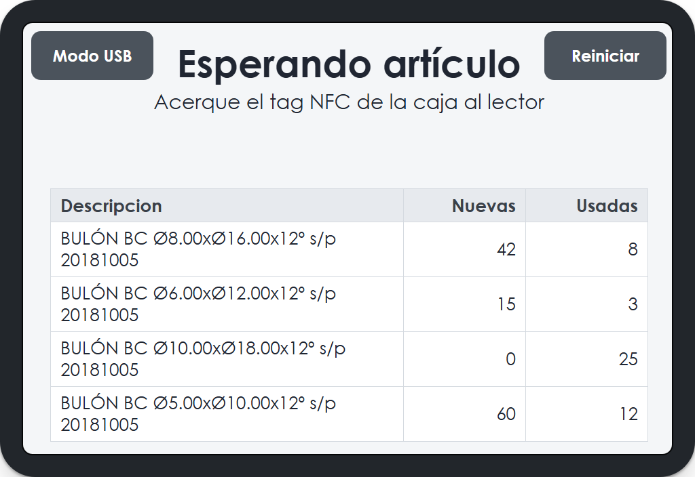

</td>
<td width="50%">

**Coloque la caja**<br>
Artículo reconocido por el tag NFC, esperando peso.
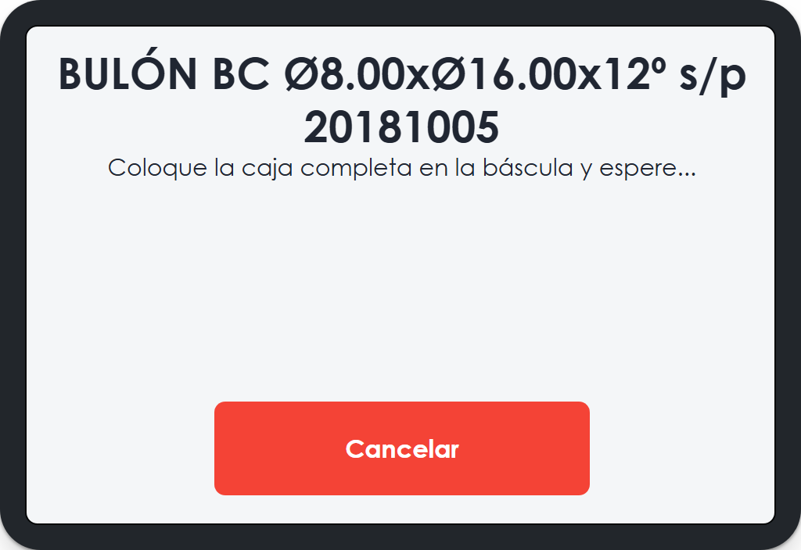

</td>
</tr>
<tr>
<td width="50%">

**RETIRE NUEVOS**<br>
Recuento en vivo mientras se retiran piezas; termina solo al vaciar la caja.
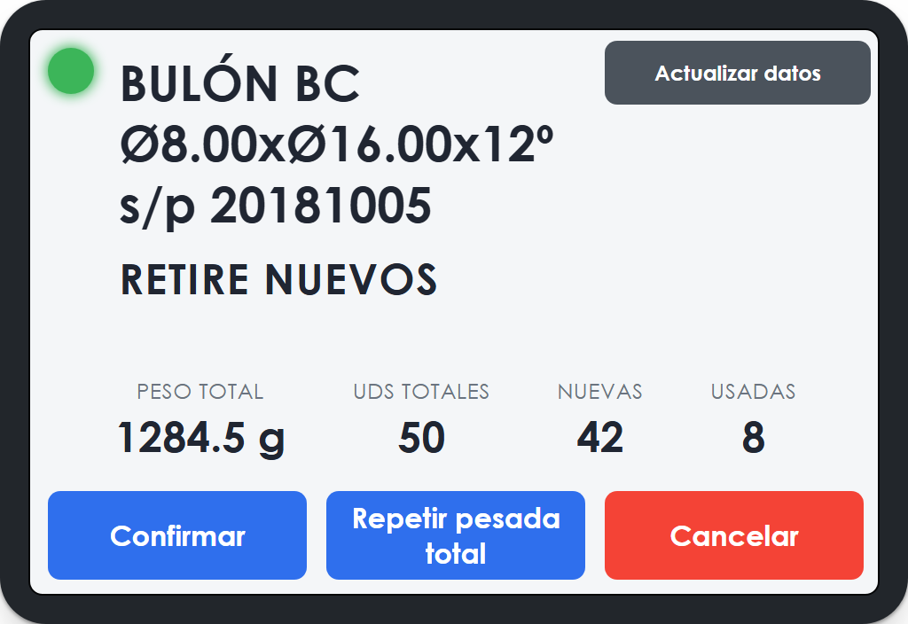

</td>
<td width="50%">

**Teclado numérico**<br>
Filas altas ancladas dinámicamente — nunca se solapan con el título, sea cual sea su longitud.
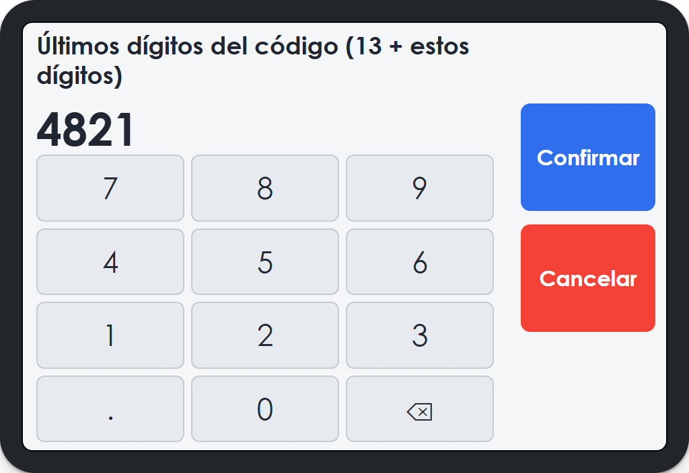

</td>
</tr>
<tr>
<td width="50%">

**Confirmar peso**<br>
Paso del alta de material nuevo.
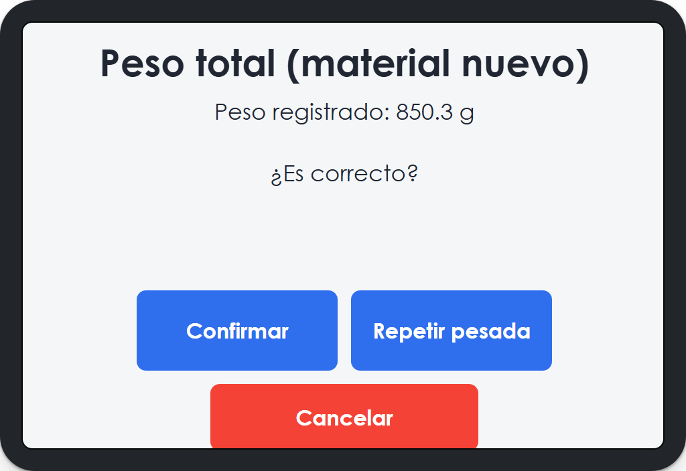

</td>
<td width="50%">

**Guardado en inventario**<br>
Resultado final de un recuento.
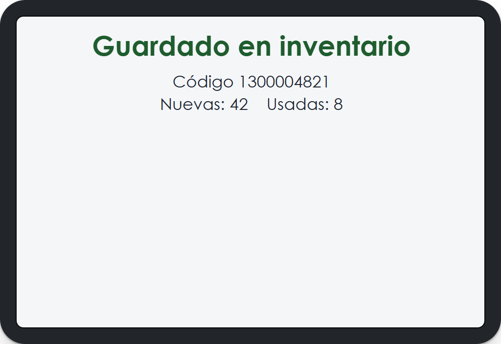

</td>
</tr>
<tr>
<td width="50%">

**Artículo duplicado**<br>
El código ya está inventariado hoy — sobrescribir o volver.
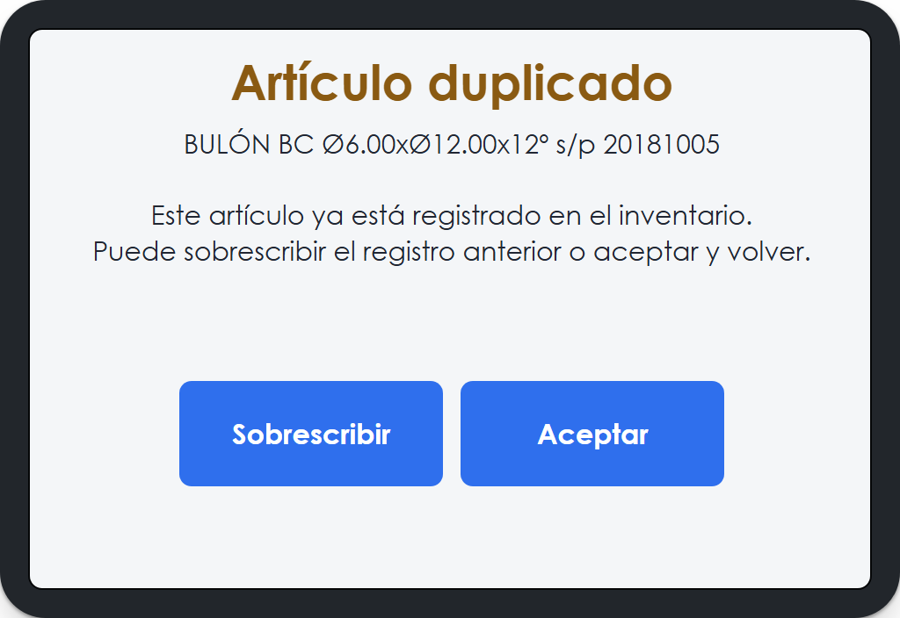

</td>
<td width="50%">

**Código ya vinculado a otro tag**<br>
Tag físico perdido/sustituido — re-vincular o cancelar.
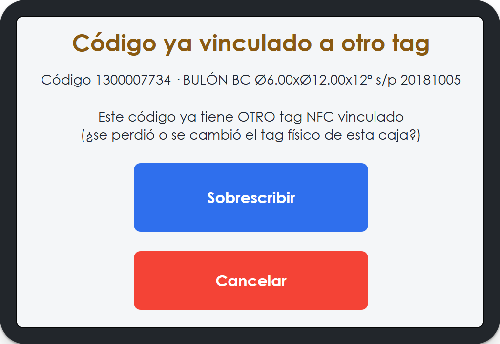

</td>
</tr>
<tr>
<td width="50%">

**Datos maestros actualizados**<br>
Confirmación tras corregir tara/peso_unitario de un artículo.
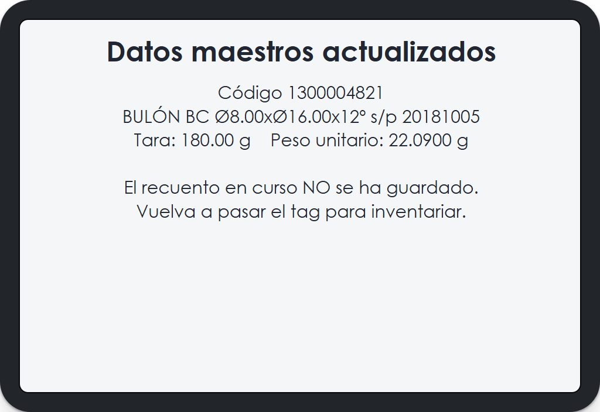

</td>
<td width="50%">

**Modo USB activo**<br>
La SD ya es un disco USB en el PC; solo se sale reiniciando.
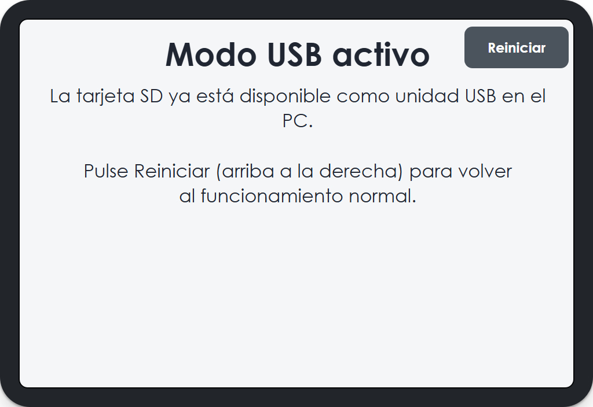

</td>
</tr>
<tr>
<td width="50%">

**Peso de tara**<br>
Alta de material nuevo o completando un precatalogado al que le faltaba la tara.
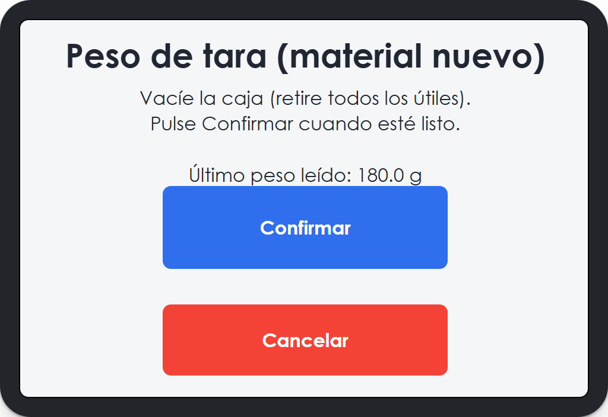

</td>
<td width="50%">

**Confirmar artículo**<br>
Antes de pedir nada más, valida que el código tecleado corresponde al material real — evita errores de tecleo o cajas mal etiquetadas.
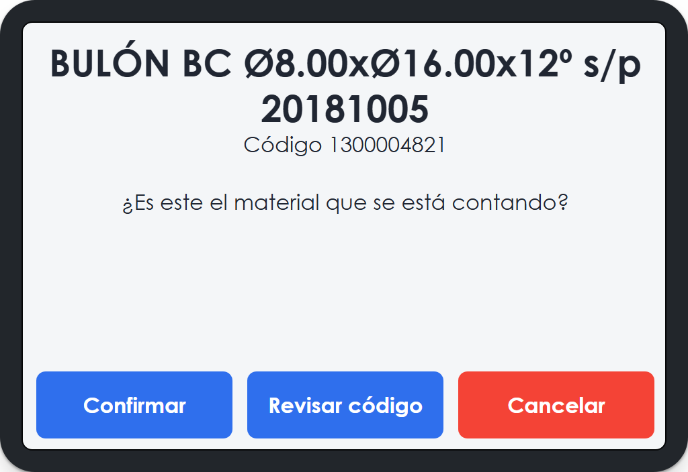

</td>
</tr>
</table>

## Funcionalidades

- **Alta guiada de material nuevo**: si el tag no está catalogado, distingue tres casos según lo
  que ya haya en `datos_maestros.csv` para el código tecleado — completo (solo vincula el tag),
  a medias (pide solo la tara y/o el peso unitario que falten) o inexistente (alta completa, con
  descripción provisional `TEMPORAL calibre x cabeza`, a corregir luego en Excel). Antes de pedir
  nada, siempre muestra la descripción a toda pantalla para validar que el código corresponde de
  verdad al material que se está contando.
- **Unidades con decimales en vivo**: mientras se retiran piezas, "Nuevas"/"Usadas" se muestran
  con un decimal (sin redondear) para ver de un vistazo cómo de preciso es el `peso_unitario`
  guardado; si el desvío respecto a un número entero supera un 15%, el número se resalta en
  naranja como aviso de posible error de calibración. Lo que se guarda en `inventario.csv` sigue
  siendo siempre un entero, redondeado al más próximo.
- **Actualizar datos maestros**: si el peso unitario o la tara guardados están mal, un botón en la
  pantalla de retirada aborta el recuento en curso y vuelve a calcular tara/peso_unitario desde
  cero (sin tocar la descripción), reutilizando el mismo tramo de pesada del alta nueva.
- **Tag perdido o sustituido**: si al dar de alta un tag nuevo el código ya tiene otro tag
  vinculado, se ofrece re-vincular (el tag físico se perdió/rompió y se ha puesto uno nuevo) o
  cancelar, en vez de bloquear asumiendo que fue un error de tecleo.
- **Modo USB Mass Storage**: expone la microSD como disco USB para sacar los CSV al PC sin abrir
  la carcasa. Al pulsarlo, el dispositivo se reinicia y arranca *directo* en modo USB (sin NFC,
  báscula ni FSM de por medio) — el ESP32-S3 solo tiene un PHY USB, y cambiar en caliente con la
  app ya corriendo era poco fiable.
- **Escritura seguros en `datos_maestros.csv`**: copia de seguridad (`.bak`) antes de cada edición,
  y la reescritura va a un fichero temporal + `fsync` antes de reemplazar el original (nunca se
  trunca el fichero real en sitio).

## Hardware

| Componente | Función | Notas |
|---|---|---|
| [JC3248W535](docs/JC3248W535%20Specifications-EN.pdf) | ESP32-S3, pantalla táctil 3.5" 320×480, 8MB PSRAM, 16MB flash | Driver de pantalla AXS15231B (QSPI) |
| PN532 | Lector NFC | I2C1, `SDA=17` `SCL=18` |
| Báscula RS232 + MAX3232 | Peso, vía UART | UART1, `TX=7` `RX=6` |
| microSD | `datos_maestros.csv` + `inventario.csv` | SPI3, `CLK=12` `MOSI=11` `MISO=13` `CS=10` |
| USB-C nativo | Modo Mass Storage bajo demanda | Comparte PHY con la consola USB-Serial/JTAG |

El altavoz I2S de la propia placa (ampli NS4168, conector "Speak") está libre en el firmware
(`BCLK=42` `LRCLK=2` `DATA=41`) pero sin usar todavía — pendiente de un aviso sonoro por evento.

## Formato de los CSV

**`datos_maestros.csv`** (catálogo de artículos, uno por código):
```
uid_nfc;codigo;descripcion;tara_caja;peso_unitario
```
`uid_nfc`, `tara_caja` y `peso_unitario` pueden venir vacíos (artículo precatalogado a la espera
de que se complete desde la app). La `descripcion` de un alta totalmente nueva empieza como
`TEMPORAL calibre x cabeza` — buscar "TEMPORAL" en Excel para corregirlas a mano, ya que no todos
los bulones siguen el mismo formato de descripción.

**`inventario.csv`** (registro de cada inventariado):
```
codigo;unidades_nuevas;unidades_usadas;hora_desde_arranque
```
`hora_desde_arranque` es tiempo transcurrido desde el arranque del ESP32 (el dispositivo no tiene
RTC ni hora de red), útil solo para medir cuánto se tarda en inventariar, no como marca de tiempo
real.

## Compilar y flashear

Requiere [PlatformIO](https://platformio.org/) (extensión de VSCode o CLI).

```
pio run -e LVGL-320-480 -t upload
pio device monitor
```

El framework es ESP-IDF (no Arduino) — ver `platformio.ini`.

## Carcasa 3D

[`enclosure/case.scad`](enclosure/case.scad) es un diseño paramétrico en OpenSCAD: pared frontal
con el PN532 en un brazo en voladizo sobre la báscula, techo inclinado para leer la pantalla desde
una mesa baja, y tapa trasera deslizante (sin tornillos) con guías en "media H" en las paredes
laterales. Ver los comentarios de cabecera del propio fichero para el despiece y montaje completos.

## Estructura del repo

```
src/            Firmware (ESP-IDF + LVGL)
boards/         Definición de la placa para PlatformIO
enclosure/      Carcasa 3D paramétrica (OpenSCAD)
docs/           Datasheets y documentación del fabricante
libraries/      LVGL (dependencia de build)
```

## Licencia

MIT — ver [LICENSE](LICENSE).
